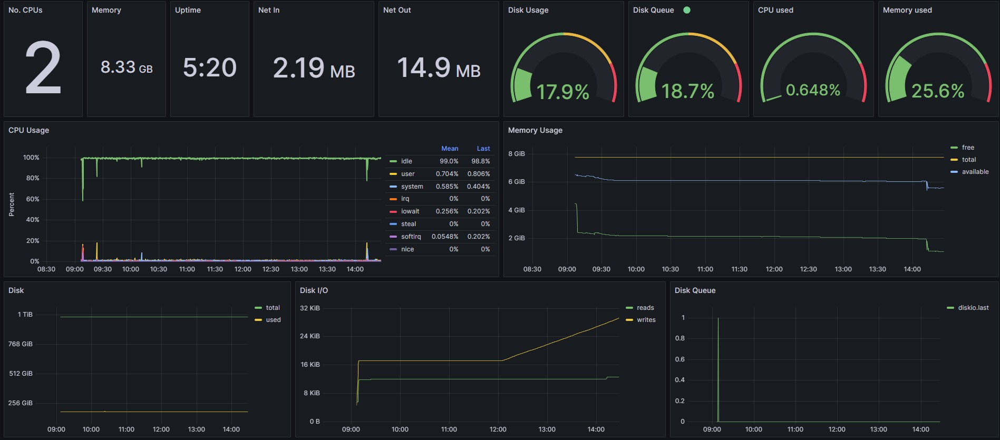

# Monitoring Dashboard
## Overview
A dashboard built in grafana that pulls metrics from an influx database that is populated by telegraf that monitors a linux instance.  
The dashboard looks as follows:
 

 
## Setup

1. Bring up the containers for telegraf, influxdb and grafana. Occasionally the telegraf container will not connect to the influx database correctly. Just restart the telegraf container once the influxdb container is up.
2. Go to localhost:3000 and login into grafana with the default username and password
3. Add a data source for the influx db:
    1. URL: http://influxdb:8086
    2. Username: admin
    3. Password: admin
4. Import the dashboard and select the influx database as the data source. 
